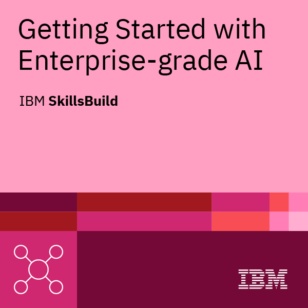
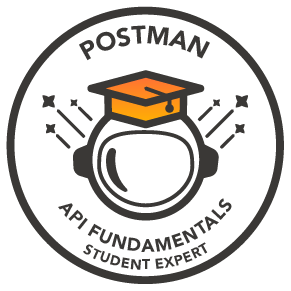
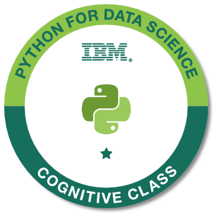
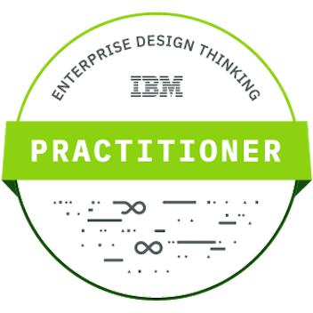

# Hi, I'm Mohd Mojiz Hasan 👋
## Ex-intern @Edunet Foundation | Aspiring Android Developer

I am a Computer Science Engineering student at Shri Ramswaroop Memorial University, set to graduate in 2025. My passion lies at the intersection of Mobile Application Development and Artificial Intelligence, aiming to create innovative solutions that make a meaningful impact.

### 🚀 About Me
- 🎓 Pursuing Computer Science Engineering (Graduating 2025)
- 💼 Ex-intern at Edunet Foundation
- 🌱 Specializing in Android Development with a focus on integrating AI and Cloud Computing
- 🔍 Seeking job opportunities to gain real-world software industry experience

### 💻 Skills

- Languages: Java (Core), Kotlin, Python (Basics)
- Frameworks & Libraries: Java Swing and Jetpack Compose
- Tools: Android Studio, Git & GitHub
- Concepts: Object-Oriented Programming (OOP)

### 🛠️ Projects
1. **Mobile Price Predictor**
   - Description: A machine learning system that accurately predicts mobile phone prices based on their features.
   - Technologies: Python, Pandas, NumPy, Machine Learning, Data Analysis, Data Cleaning
   - Try it [here](https://huggingface.co/spaces/MojizHasan786/Mobile_Price_Predictor).

2. **Parking Lot Management System**
   - Description: A GUI-based Desktop Application for managing parking lot areas.
   - Technologies: Java, Java Swing, MySQL, JDBC, NetBeans
   - [GitHub Repo](https://github.com/SyedRizvi786092/parking-lot-management)

3. **Weather App**
   - Description: A simple Android application providing current weather conditions for a given location.
   - Technologies: Kotlin, XML, Android Studio
   - [GitHub Repo](https://github.com/SyedRizvi786092/weather-app)
  
### 🏅 Certifications & Badges

### 🌟 Goals
- Dive deeper into Android Development
- Explore integration of Cloud Computing and AI in mobile apps
- Contribute to innovative projects that blend mobile development with emerging technologies

### 🤝 Get in Touch
- Connect with me on [LinkedIn](https://www.linkedin.com/in/mohd-mojiz-hasan-a28b382b9),
- Or [Mail](mailto:mojiz.hasan.786@gmail.com) me.

---
Thanks for stopping by! Let's connect and explore how we can drive the future of tech together!
